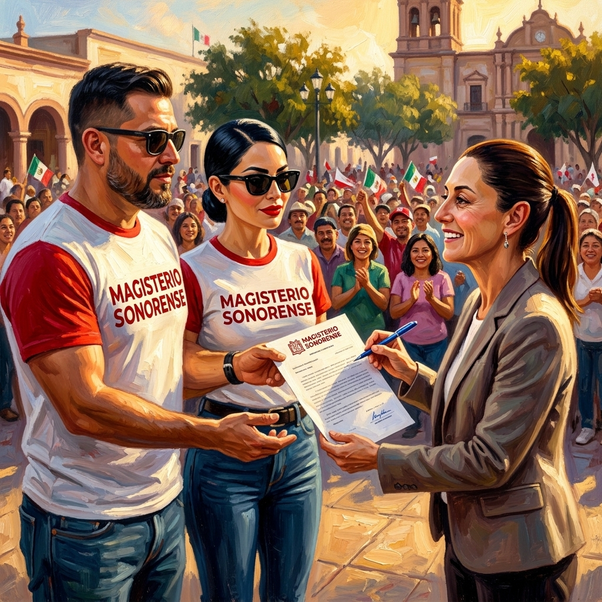

# 📖 LIBRO DIGITAL MS: TOMO XXII — LA FUERZA DE LA BASE
## Serie: Nuestras Fábricas de Ignorancia y la Rebelión del Magisterio Sonorense

---

---

## 🗂️ FICHA EDITORIAL: TOMO XXII

*   **Título:** *Tomo XXII: La Fuerza de la Base (La Firma de Cajeme)*
*   **Autor:** Comité de Inteligencia y Coordinación Política del Magisterio Sonorense (MS)
*   **Clasificación:** Crónica Operativa Forense y Formación Discursiva para la Base
*   **Fecha de Lanzamiento:** 10 de Mayo de 2026 (Día de las Madres)
*   **Locus:** Cajeme, Sonora — Tierra del Yaqui y la Resistencia

---

## INTRODUCCIÓN: LA JORNADA HISTÓRICA QUE REDEFINIÓ LA LUCHA

¿Creían las cúpulas del sindicato tradicional y los burócratas de oficina que nos quedaríamos inmóviles esperando a que nos sigan postergando la resolución de nuestras demandas de retiro? Subestimaron la capacidad de organización y la determinación del Magisterio Sonorense (MS). Mientras la representación sindical tradicional ensaya simulaciones frente al espejo para salir en la foto oficial, la verdadera base docente de Sonora se dispuso a trabajar de lleno en el territorio.

Este Tomo XXII no fue redactado detrás de un escritorio con aire acondicionado. Se forjó bajo la intensa jornada y las altas temperaturas de Cajeme, con la firmeza del magisterio en el pecho y el rigor actuarial de la **Pensión Intergeneracional Protegida (PIP)** en la mano. Hoy, 10 de mayo de 2026, los compañeros sacaron la casta y le demostraron al país que cuando la base se organiza de forma racional y con diálogo técnico, no existen barreras institucionales ni burocracias capaces de contenerla.

Aquí se presenta la crónica de cómo superamos los cercos de la simulación oficial y obtuvimos directamente del primer nivel del Estado Mexicano la firma que abre el camino hacia un sistema de jubilaciones justo para el magisterio de Sonora. **¡Adelante, Sonora, que el futuro se construye con propuesta!**

---

## CAPÍTULO 1: LA FIRMA DE CAJEME — LAS COMPAÑERAS MANDAN Y LA BASE AVANZA

### I. La Escena de la Gira y la Simulación de la Sección 28

El escenario estaba perfectamente delineado. Domingo 10 de mayo, Día de las Madres. Las altas temperaturas sonorenses caían de lleno sobre Cajeme. La logística y el equipo de seguridad de la Presidenta **Dra. Claudia Sheinbaum Pardo** mantenían un estricto control de acceso. El objetivo gubernamental era un evento de carácter puramente institucional, centrado en los anuncios de infraestructura y salud del estado.

Apenas tres días antes, el 7 de mayo, la dirigencia de la **Sección 28 del SNTE** había montado una movilización improvisada afuera de una clínica del ISSSTE en el sur del estado. Utilizando consignas que plagiaron directamente del MS —tales como *"Jubilaciones Dignas"* y *"Abrogación de la Ley 2007"——, la burocracia sindical intentó desviar la atención de los docentes de Sonora. Su intención táctica era clara: colgarse de la agenda de pensiones construida por el MS y simular una movilización combativa ante la llegada de la Presidenta para posicionarse como los interlocutores exclusivos de la federación. Buscaban desactivar la mística de la base y negociar, bajo un esquema tradicional, sus cuotas de poder personal.

**Sin embargo, la maniobra quedó neutralizada.** Mientras la dirigencia sindical oficialista repite consignas sin poseer un solo estudio actuarial o propuesta financiera que dé viabilidad a sus demandas, el Magisterio Sonorense opera con rigor científico y representatividad real de base.

### II. El Maestro Kristian y Paloma: Rostro de Compromiso y Determinación de la Base

La jornada del 10 de mayo revistió una gran importancia estratégica. En el Día de las Madres, fueron nuestros compañeros de base quienes asumieron la representación del movimiento en la valla de contacto. El **Maestro Kristian** y la maestra **Paloma** no portaban consignas de confrontación ni adoptaron posturas estériles. Su legitimidad residía en la seriedad del magisterio de Sonora y en el **Oficio Núm. MS-01/2026** —un documento de alto nivel técnico elaborado con absoluta formalidad—.

Al paso de la comitiva presidencial entre la multitud y bajo el riguroso escrutinio de la seguridad institucional, los compañeros se mantuvieron firmes. El MS no acudió a improvisar protestas; acudió a proponer soluciones viables. Al identificar la seriedad del planteamiento, la Presidenta Claudia Sheinbaum —quien posee una formación científica rigurosa y valora los estudios de viabilidad financiera— se detuvo a recibirlos.

La imagen que corona este tomo es testimonio vivo de ese momento: nuestros compañeros entregando formalmente el pliego de la **PIP** y la Presidenta de la República, con actitud de respeto y apertura institucional, firmando de su puño y letra la recepción del documento con la rúbrica **"claudia Sh"** en la esquina superior derecha del oficio. **La firma presidencial de recibido es un hecho.** Se obtuvo de manera directa en el territorio, superando intermediarios de cúpula y abriendo de facto el diálogo técnico con la base sonorense.

### III. El Análisis Forense del Audio: "¡No somos la CNTE, somos la base!"

El registro sonoro de la interacción constituye una pieza de análisis político extraordinario. La transcripción de la conversación en la valla de contacto revela la precisión discursiva de nuestra representación:

> *“Buenos días presidenta, buenos días. Queremos colaborar con ustedes, tenemos una exigencia para los Trabajadores al Servicio del Estado. Es una propuesta que tenemos para ustedes... para todos los trabajadores, que no lastima la economía de los trabajadores ni las finanzas públicas...”*

Este planteamiento sintetiza con exactitud la premisa de la PIP. Al enfatizar ante la Presidenta que el modelo **no lastima las finanzas públicas**, se neutraliza de origen la resistencia técnica de la Secretaría de Hacienda. El posicionamiento estratégico alcanzó su punto culminante de inmediato:

> *“...y queremos que nos apoyen, que nos apoyen para poder recibir una mesa técnica que se ponga a analizar esta propuesta, presidenta... ¡No somos la CNTE, somos la base que queremos ser escuchados! Queremos que nos dé un espacio, presidenta... ¿Cuándo nos puede tener fechas?”*

Esta declaración posee una enorme relevancia política. Al desmarcarse explícitamente de las siglas de la CNTE, el Magisterio Sonorense se blinda contra los intentos del aparato oficialista de catalogar el descontento local como un "grupo de choque radical" o "movilización intransigente". Los compañeros demostraron ante la Jefa del Ejecutivo que en Sonora se ha construido una **Tercera Vía**: un movimiento que estudia, que presenta propuestas con sustento legislativo federal (como el pre-estudio del Instituto Belisario Domínguez) y que exige el establecimiento de mesas técnicas mediante el debate serio de ideas.

Asimismo, la acción coordinada abarcó respetuosamente al Gobernador del Estado, **Alfonso Durazo Montaño**:

> *“...¡Gobernador, gobernador! Somos el magisterio sonorense, gobernador, queremos las mesas técnicas... ahí está mi compañero Cristian... queremos fechas gobernador, queremos fechas de... firme esto por favor. Gracias.”*

Al interactuar con el mandatario estatal en presencia de la comitiva presidencial, se estableció una pinza institucional que compromete el seguimiento a nivel local. El Gobernador asintió con respeto y arropó formalmente la entrega del documento, sabiendo que la propuesta técnica ya contaba con la firma de recibido de la Presidenta. Las estructuras tradicionales quedaron al descubierto y sin argumentos discursivos.

---

## CAPÍTULO 2: NAVOJOA — LA CNTE SIN ARGUMENTOS ANTE LA RAZÓN DE ESTADO

### I. El Enfrentamiento en el Canal de Riego: Consignas contra Ciencia

El sábado 9 de mayo de 2026, durante el evento oficial de inauguración de la primera etapa del Canal de Riego en Navojoa, la delegación de la Coordinadora Nacional de Trabajadores de la Educación (CNTE) en Sonora, encabezada por la maestra **Mercedes**, optó por su tradicional estrategia de choque directo y disrupción ruidosa. 

Interrumpiendo a gritos el discurso oficial de la Presidenta **Dra. Claudia Sheinbaum Pardo**, la dirigencia local de la CNTE exigió la apertura inmediata de una Mesa Nacional de Diálogo, demandando la asignación directa de bases para telesecundarias y la abrogación general de la Ley del ISSSTE de 2007.

La respuesta de la Presidenta fue un ejercicio de absoluta templanza y firmeza de Estado. Sheinbaum, con su rigurosa formación científica y pragmatismo técnico, no rehuyó el debate, sino que desarmó de origen la retórica vociferante de la CNTE: les solicitó de forma calmada pero enérgica permitir el desarrollo del evento institucional y propuso una mesa de trabajo coordinada con las autoridades educativas federales y el Gobernador **Alfonso Durazo Montaño**, dejando en claro que el diálogo gubernamental se rige por canales formales, no por el chantaje ni la disrupción de la agenda pública.

### II. Mtra. Mercedes ante el Gobernador Durazo: El Vacío de la Propuesta

El registro audiovisual del diálogo posterior entre la maestra Mercedes de la CNTE y el Gobernador Alfonso Durazo revela la debilidad estructural del movimiento ultra-radical. Frente al cuestionamiento respetuoso del mandatario sonorense —quien escuchó atento con gesto pensativo y mano al mentón bajo el sol de la tarde—, la representación de la CNTE demostró su total parálisis de propuesta. 

La maestra Mercedes insistió de forma reiterativa:
> *“Lo concreto es que se pueda aperturar la mesa nacional de diálogo con la CNTE para que trabaje la... hemos tenido mesas en un nivel que no resuelve...”*

Este planteamiento desnudó el vacío conceptual de la CNTE. Mientras el Magisterio Sonorense (MS) asiste al diálogo con un proyecto de ley redactado con absoluta solvencia técnica, cálculos de viabilidad financiera y pre-estudios actuariales (la PIP), la CNTE en Sonora acude a exigir "mesas de diálogo" genéricas para que "se trabaje" en soluciones que ellos mismos no saben formular. No poseen un solo estudio de costos presupuestales, carecen de análisis actuariales formales y su única bandera es la queja sistemática.

La CNTE quedó expuesta: son un movimiento de denuncia estéril, sin argumentos de fondo ante los científicos y economistas del gobierno federal. Se demostró que exigir "mesas" sin un proyecto viable en la mano es solo una simulación más de movilización para justificar cuotas burocráticas personales.

---

### 🔍 ANÁLISIS COMPARATIVO DE LA REPRESENTACIÓN

*   **La Sección 28 del SNTE:** Evidencia su parálisis intelectual. Sus movilizaciones carecen de propuestas de fondo y se limitan a demandar una abrogación absoluta que resulta inviable bajo las actuales condiciones macroeconómicas del país. Utilizan retóricas ajenas para intentar contener el avance del MS sin ofrecer soluciones reales a sus agremiados.
*   **La Coordinadora Nacional (CNTE):** El 9 de mayo, durante la inauguración de la primera etapa del Canal de Navojoa, recurrieron a su clásico esquema de confrontación-negociación sin propuesta técnica. Interrumpieron a gritos el evento oficial exigiendo bases para telesecundarias y la reforma a la Ley ISSSTE 2007, forzando una mesa de diálogo improvisada con la federación y el Gobernador Alfonso Durazo. Al carecer de un sustento actuarial real, su movilización se redujo a la disrupción verbal, evidenciando un vacío de propuesta sustantiva que contrasta tajantemente con la mística y solvencia intelectual del MS.
*   **El Magisterio Sonorense (MS):** Se consolida como la alternativa técnica seria. En contraste con la disrupción estéril de la CNTE en Navojoa el 9 de mayo, la delegación del MS en Cajeme el 10 de mayo demostró altura política e institucional. Sin gritos ni bloqueos, entregó directamente a la Presidenta de la República la propuesta de la **Pensión Intergeneracional Protegida (PIP)** —sustentada en cálculos financieros serios, pre-estudios del Instituto Belisario Domínguez y viabilidad presupuestal—, logrando de inmediato su firma presidencial de recibido. El MS organiza propuestas y firma conquistas directo con el primer nivel del Estado Mexicano.

---

## CONCLUSIÓN DE INTELIGENCIA ESTRATÉGICA

La recepción firmada del **Oficio MS-01/2026** por parte de la Presidenta Claudia Sheinbaum es el logro político y técnico de mayor impacto para el MS en la entidad. Se ha acreditado de manera contundente que la base docente de Sonora posee la capacidad intelectual y organizativa para interactuar con la cúspide del Estado sin requerir la mediación de dirigencias cooptadas.

La firma está plasmada, el registro audiovisual es público y el compromiso institucional ha quedado asentado. Corresponde ahora al MS socializar esta victoria en cada escuela, zona escolar y región de Sonora. El mensaje es claro: mientras las cúpulas administran promesas, el Magisterio Sonorense organiza propuestas y firma conquistas.

**¡POR LA DEFENSA DE NUESTROS DERECHOS LABORALES!**
**¡JUBILACIÓN DIGNA PARA TOD@S CON PROPUESTA Y DIÁLOGO TÉCNICO!**

---
**BIBLIOTECA DIGITAL DEL MAGISTERIO SONORENSE — CAJEME, SONORA, MAYO 2026**
